# TL课题组主页修补清单

`[■■■■■■■■□□] 80%`

## Todo List

- [x] 调整站点一级导航，改为 `首页 / 关于我们 / 研究领域 / 团队成员 / 课程与实验 / 项目与学术成果`。
- [x] 替换站点品牌元素：左上角字母 `A` 已改为 `TL` 品牌标识，站点标题已改为 `Technologie Lithique`。
- [x] 更新首页 Hero 文案：主标题、副标题、简介统一替换为文档给定版本。
- [x] 合并或统一“关于实验室 / 关于我们”内容，明确页面结构，避免重复。
- [x] 在关于页补充课题组定位信息：二级学科、李英华教授及课题组研究方向、跨学科协作与国际合作说明。
- [x] 为“研究领域”做可点击的详情入口，不再只停留在三个展示栏。
- [x] 建立三个研究方向的详情页或等效内容容器，并分别挂载配图、简介、论文、书籍或学位论文。
- [x] 录入“石器技术研究”方向的期刊论文与书籍清单。
- [x] 录入“汉水流域与长江中游史前人类的石器技术与行为研究”方向的期刊论文与硕博论文清单。
- [x] 录入“华南与东南亚古人类的技术与行为研究”方向的期刊论文与硕博论文清单。
- [x] 补充团队成员展示，新增韦璇、李康康、牛文渊三位老师。
- [x] 梳理 `Publication` 数据结构，明确论文、书籍、学位论文、项目成果的字段与展示方式。
- [x] 录入项目列表，包括国家社科基金、校内项目、留学回国基金等已有条目。
- [x] 在“项目与学术成果”中补充书籍成果，等待后续补全资料。
- [x] 将原“项目”页改造成“课程与实验”，新增“慕课”“虚拟仿真实验”两个页面或入口。
- [ ] 将 `TL` 占位品牌标识替换为课题组正式 logo。
- [ ] 更换或补齐原文中标记为“先配这个图”“回头找清楚的/没水印的”的图片资源。
- [ ] 补充李康康、牛文渊等新增教师的详细简介、照片与联系方式。

## 文档信息

- 来源文档：`D:/data/wxfiles/xwechat_files/p392187551_8eeb/msg/file/2026-04/tl课题组主页搭建需求 0326.docx`
- 提取时间：`2026-04-25`

## 原文拆解（按原始逻辑顺序）

1. 表头这里修改一下

2. 首页、关于我们、研究领域、团队成员、项目（修改为“课程与实验”）、项目与学术成果（把书放到这部分）

3. 图片
   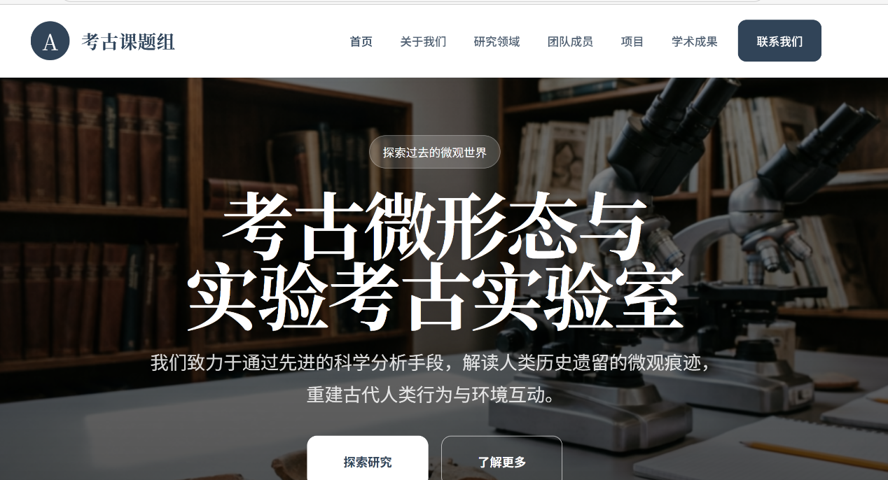

4. 左上角的这个A可以改成课题组的logo吗？我得再做个图案

5. “考古课题组”改成“Technologie Lithique”

6. 中间

7. “探索过去的微观世界”改成“解析石器技术的内在逻辑”

8. “考古微形态与实验考古实验室”改成“石器技术实验室” 虽然听起来不太高大上啊，先写上吧，回头让我导师再取名字。

9. 下面这段介绍改成“我们致力于通过技术学分析、三维重建手段，解读旧石器时代古人类的技术与生活，重建史前人类的生存图景。”

10. 首页的这个关于实验室和关于我们是一回事儿吗

11. 图片
   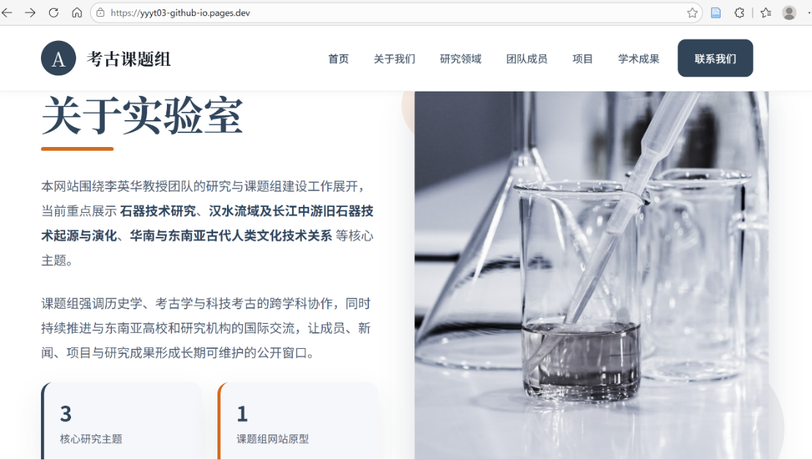

12. 图片
   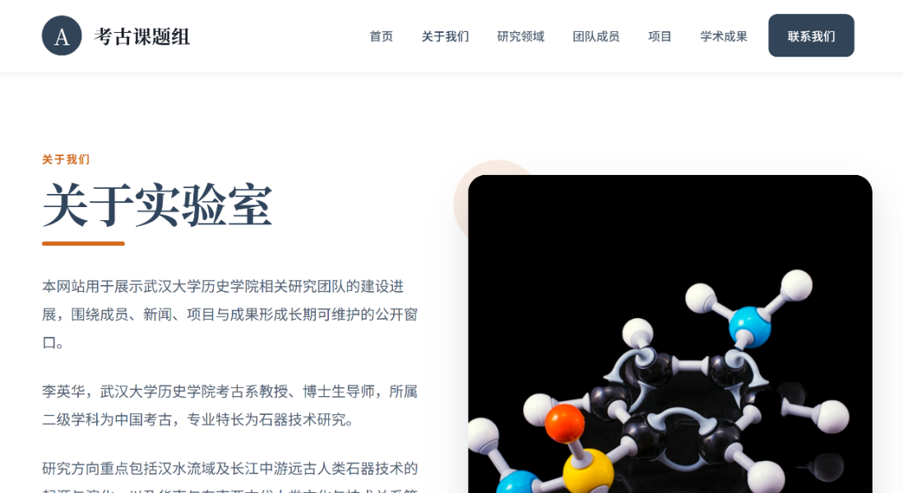

13. 嗨，我感觉差不多，就写一个内容吧，把我导师这个研究内容总结的挺好

14. 二级学科应该是先秦考古

15. 李英华教授及其课题组的研究领域为石器技术研究、汉水流域与长江中游史前人类的石器技术与行为研究、华南与东南亚古人类的技术与行为研究等主题。

16. 本课题组致力于考古学、历史学、人工智能、文化遗产和测绘等专业的跨学科协作，同时持续推进与欧洲、东南亚等地区高校和研究机构的国际交流与合作。

17. 这个放到第一个关于实验室那页
   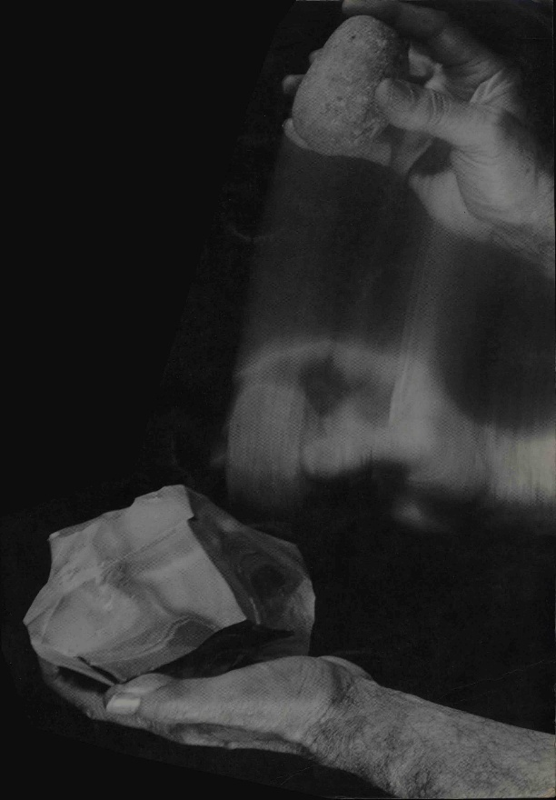

18. 这个放到第二个关于实验室那页
   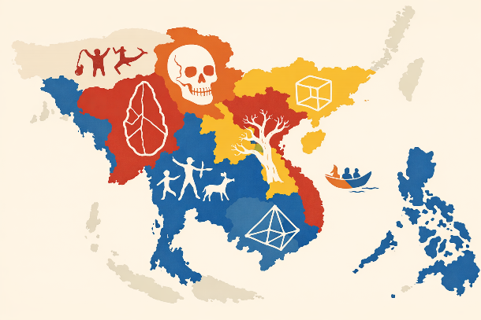

19. 图片
   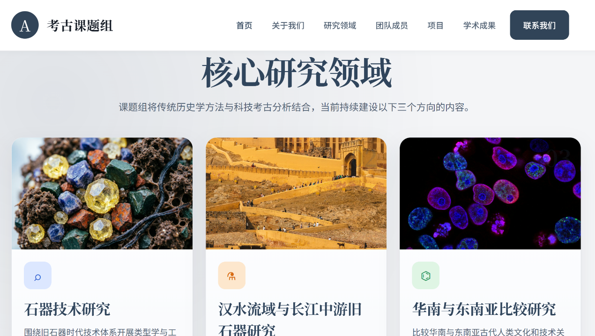

20. 研究领域：

21. 这边可以点进去吗？现在貌似只有这三个展示栏。

22. 可以丢一些课题项目、硕博士论文、已发表的成果进去，我整理下

23. 课题组的主要研究领域为以下三个方向。

24. 石器技术研究 配图

25. 图片
   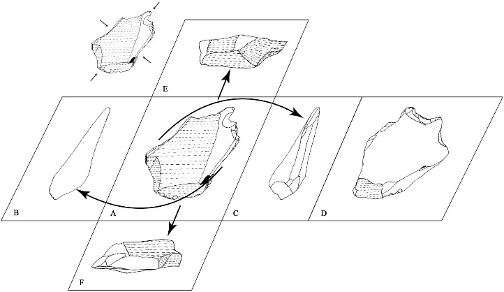

26. 揭示我国旧石器工业内部及工业之间的多样性、探索它们与世界其他地区石器工业的共性及差异性。

27. 点进去以后放的内容：

28. 期刊论文：

29. [1]李英华. 类型、技术与人——考古学者基于技术逻辑的思考[J].南方文物,2025,(01):28-37.

30. [2]李英华,余西云. 考古学对于“文化”和“传播”的思考[J].跨文化传播研究,2023,(02):51-62.

31. [3]李英华,李桓. 陕西大荔人遗址石制品的新研究[J].边疆考古研究,2015,(02):121-134.

32. [4]李英华,包爱丽,侯亚梅. 石器研究的新视角:技术-功能分析法——以观音洞遗址为例[J].考古,2011,(09):58-70+113.

33. [5]李英华,李英华,侯亚梅,等. 旧石器技术研究法之应用——以观音洞石核为例[J].人类学学报,2009,28(04):355-362.DOI:10.16359/j.cnki.cn11-1963/q.2009.04.015.

34. [6]李英华,侯亚梅,Boёda E. 观音洞遗址古人类剥坯模式与认知特征[J].科学通报,2009,54(19):2864-2870.

35. [7]李英华,侯亚梅,Erika BODIN. 法国旧石器技术研究概述[J].人类学学报,2008,(01):51-65.DOI:10.16359/j.cnki.cn11-1963/q.2008.01.012.

36. [8]李英华,余西云,侯亚梅.关于三峡地区石器工业中的锐棱砸击制品[C]//中国科学院古脊椎动物与古人类研究所,福建省文化厅,三明市人民政府.第十届中国古脊椎动物学学术年会论文集.,2006:268-279.

37. [9]吴沄,邱开卫,罗伊,等. 云南沧源汤不拉和平文化洞穴遗址石制品的初步研究[J].南方文物,2024,(02):219-230.

38. [10]周玉端,李英华. 技术本体论视角下的旧石器技术研究[J].考古,2024,(02):66-77.

39. [11]周玉端,李英华,韦军,等. 广西桂林市甑皮岩遗址砾石工具的技术-功能分析及相关问题[J].考古,2023,(01):65-78.

40. [12]韦璇,李英华,娄文台,等. 中国考古的国际化分析——从中外考古期刊论文数据出发[J].南方文物,2022,(01):30-40.

41. [13]贺成坡,韦璇,李英华. “新石器”研究方法概述[J].江汉考古,2021,(06):268-277.

42. [14]贺成坡,李英华,韦璇,等. 湖北石首市走马岭遗址石器原料溯源分析[J].四川文物,2021,(06):43-51.

43. [15]周玉端,李英华. 旧石器类型学与技术学的回顾与反思[J].考古,2021,(02):68-80+2.

44. [16]李锋,李英华,高星. 贵州观音洞遗址石制品剥片技术辨析[J].人类学学报,2020,39(01):1-11.DOI:10.16359/j.cnki.cn11-1963/q.2020.0001.

45. [17]周玉端,李英华. 从遗物展示到技术阐释:法国旧石器绘图方式的变迁和启示[J].考古,2019,(02):63-73.

46. [18]周玉端,李英华. 东南亚和平文化研究的新进展[J].考古,2017,(01):68-77.

47. [19]Li F, Li Y, Gao X, et al. A refutation of reported Levallois technology from Guanyindong Cave in south China[J]. National Science Review, 2019, 6(6): 1094-1096.

48. [20]Li Y, Boëda E, Forestier H, et al. Lithic Technology, typology and cross-regional comparison of Pleistocene lithic industries: Comment on the earliest evidence of Levallois in East Asia[J]. L'anthropologie, 2019, 123(4-5): 769-781.

49. [21]Li Y H, Hou Y M, Boëda E. Mode of débitage and technical cognition of hominids at the Guanyindong site[J]. Chinese Science Bulletin, 2009, 54(21): 3864-3871.

50. 书籍：

51. [1]李英华.旧石器技术[M].社会科学文献出版社:201706:473.

52. 汉水流域与长江中游史前人类的石器技术与行为研究：

53. 先配这个图，回头我再找清楚的。
   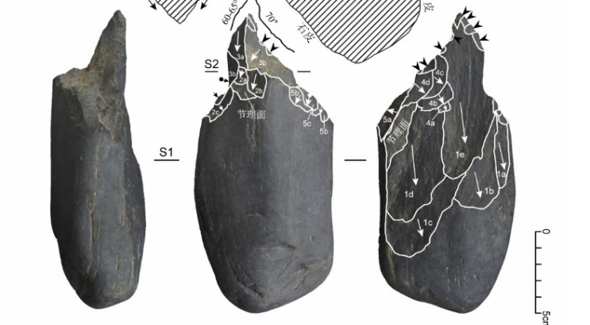

54. 点进去以后放的内容：

55. 期刊论文：

56. [1]李英华,周玉端,孙雪峰. 湖北郧县后房遗址石器工业的年代、操作链及其意义[J].江汉考古,2018,(02):36-47.

57. [2]李英华. 大冶石龙头遗址石器的新研究[J].江汉考古,2011,(02):45-53.

58. [3]李英华,孙雪峰. 湖北郧县后房旧石器遗址发掘简报[J].江汉考古,2013,(01):6-15.

59. [4]李英华,周玉端. 试论古人对石器工业生产体系的管理模式——以郧县后房旧石器遗址为例[J].江汉考古,2015,(04):71-78.

60. [5]贺成坡,李英华,韦璇,等.湖北石首市走马岭遗址石器原料溯源分析[J].四川文物,2021,(06):43-51.

61. [6]Lou W, Wang F, Wei X, et al. Identification and implications of lithic artifacts starch residues from Fenghuangzui Neolithic site in Central China[J]. npj Heritage Science, 2025, 13(1): 511.

62. [7]Li Y, Sun X, Bodin E. A macroscopic technological perspective on lithic production from the Early to Late Pleistocene in the Hanshui River Valley, central China[J]. Quaternary International, 2014, 347: 148-162.

63. [8]Li Y, Zhou Y, Sun X, et al. New evidence of a lithic assemblage containing in situ Late Pleistocene bifaces from the Houfang site in the Hanshui River Valley, Central China[J]. Comptes Rendus Palevol, 2018, 17(1-2): 131-142.

64. [9]Li Y, Bodin É. Variabilité et homogénéité des modes de débitage en Chine entre 300 000 et 50 000 ans[J]. L'Anthropologie, 2013, 117(5): 459-493.

65. [10]Ying-hua L I, Ya-mei H O U, BOËDA E. Methodological application of the paleolithic technological research, a case study of a core from the Guanyindong Site[J]. Acta Anthropologica Sinica, 2009, 28(04): 355.

66. [11]Yang R, Xue L, Jin Y, et al. Combined approaches of techno-functional and use-wear analysis indicated diverse reuse behaviors of polished bevelled stone tools of Zoumaling site (5500–3900 cal BP), central China[J]. npj Heritage Science, 2026, 14(1): 68.

67. 硕博士论文：

68. [1]杨濡僖.磨制带刃石制品的功能与再利用——以走马岭遗址石器技术-功能和微痕分析为例[D].武汉大学,2024.

69. [2]娄文台.湖北襄阳凤凰咀遗址出土石制品的淀粉粒分析[D].武汉大学,2023. DOI: 10.27379/d.cnki.gwhdu.2023.000056.

70. [3]贺成坡.湖北石首走马岭遗址石器工业分析[D].武汉大学,2022. DOI: 10.27379/d.cnki.gwhdu.2022.000432.

71. 华南与东南亚古人类的技术与行为研究

72. 先配这个图，回头我再找没水印的。
   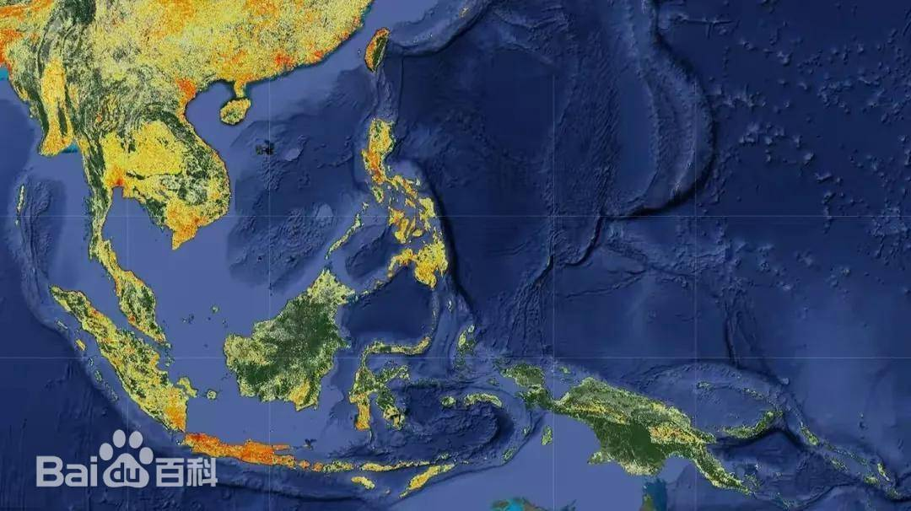

73. 点进去以后放的内容：

74. 期刊论文：

75. [1]李英华,赵春光. 新世纪背景下的华南与东南亚早期文化关系的考古学研究[J].南方文物,2020,(05):51-59.

76. [2]李英华,林美蓉,邓鸿山,等. 越南和平文化石器技术分析及对华南东南亚砾石石器工业研究的启示[J].南方文物,2020,(05):90-105.

77. [3]李英华,周玉端,郝思德,等. 海南三亚落笔洞遗址石器工业新研究——与东南亚和平文化遗址的比较[J].考古,2020,(01):68-81.

78. [4]韦璇,李英华. 越南史前考古学研究历史、现状与趋势[J].江汉考古,2025,(06):165-176+185.

79. [5]韦璇,梁婷婷,苏吀端.缅甸史前考古研究概述[J].南方文物,2024,(01):180-197.

80. [6]梁婷婷,韦璇.泰国史前考古学史[J].南方文物,2024,(01):198-211.

81. [7]韦璇.马来西亚史前考古学史[J].南方文物,2022,(03):199-209.

82. [8]洪晓纯,娄文台,韦璇.华南沿海、台湾和岛屿东南亚的早期航海与文化：公元前6000年至公元前500年[J].南方文物,2024,(01):224-234.

83. [9]Li Y, Hao S, Huang W, et al. Luobi cave, south China: a comparative perspective on a novel cobble-tool industry associated with bone tool technology during the pleistocene–holocene transition[J]. Journal of World Prehistory, 2019, 32(2): 143-178.

84. [10]Wei X, Liang T, Soe M T, et al. The history of prehistoric archaeology in Myanmar: A brief review[J]. Asian Archaeology, 2023, 7(2): 203-219.

85. [11]Yinghua L, Dung L T M, So’n Đ H, et al. A new technological analysis of Hoabinhian stone artifacts from Vietnam and its implications for cultural homogeneity and variability between mainland Southeast Asia and South China[J]. Asian Perspectives, 2021, 60(1): 71-96.

86. [12]Wu Y, Qiu K, Luo Y, et al. Dedan Cave: Extending the evidence of the Hoabinhian technocomplex in southwest China[J]. Journal of Archaeological Science: Reports, 2022, 44: 103524.

87. [13]Wu Y, Jiao Y, Ji X, et al. High-precision U-series dating of the late Pleistocene–early Holocene rock paintings at Tiger Leaping Gorge, Jinsha River valley, southwestern China[J]. Journal of Archaeological Science, 2022, 138: 105535.

88. [14]Wang X, Cen H, Zhang X, et al. New evidence for the terminal pleistocene funerary-associated ochre use in southwestern China[J]. npj Heritage Science, 2025, 13(1): 578.

89. [15]Chen X, He A, Sun X, et al. Guomo open-air site (15–12 ka) in Guangxi Zhuang Autonomous Region, southern China: A new cobble-based industry for rethinking the definition of “Hoabinhian”[J]. Journal of Archaeological Science: Reports, 2023, 49: 104033.

90. [16]Wu Y, Qiu K, Jin Q, et al. The Hoabinhian technocomplex in southwest China: Preliminary report on new discoveries in recent decades[J]. L'Anthropologie, 2024, 128(1): 103234.

91. [17]Zhou Y, Cai S, Liu X, et al. Cobbles during the final Pleistocene-early Holocene transition: An original lithic assemblage from Maomaodong rockshelter, Guizhou Province, southwest China[J]. Archaeological Research in Asia, 2022, 32: 100411.

92. [18]Wei G, Huang W, Boeda E, et al. Recent discovery of a unique Paleolithic industry from the Yumidong Cave site in the Three Gorges region of Yangtze River, southwest China[J]. Quaternary International, 2017, 434: 107-120.

93. [19]Zhou Y, Shen Z, Wu Y, et al. The knapping strategies in the Paleolithic on the Yunnan-Guizhou Plateau, southwest China: A regional particularity[J]. L'Anthropologie, 2023, 127(4): 103195.

94. 硕博士论文：

95. [1]梁婷婷.泰国史前考古学史[D].武汉大学,2022.DOI:10.27379/d.cnki.gwhdu.2022.000043.

96. [2]李桓.菲律宾史前考古研究概述[D].武汉大学,2018.

97. [3]陈鹏.越南旧石器文化概述[D].武汉大学,2019.

98. [4]周玉端.柳州白莲洞遗址石器工业的技术分析[D].武汉大学,2017.

99. 图片
   

100. 哈哈哈这照片真是非常好看

101. 后面可以把这三个主页可以丢进去，也是我们课题组的老师

102. 韦璇-历史学院、李康康-历史学院、牛文渊-历史学院

103. 图片
   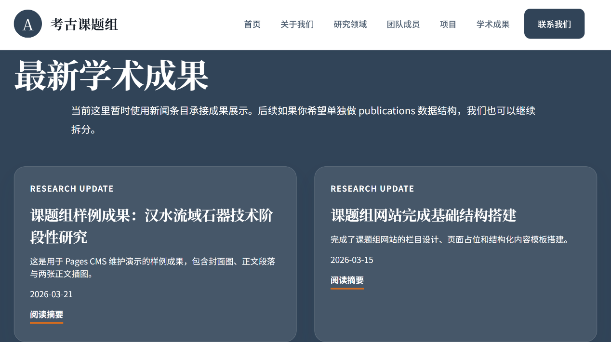

104. Publication数据结构是啥意思。

105. 项目可以放这些

106. 主持国家社科基金重大项目“东亚地区人类起源问题综合研究”，在研。

107. 主持国家社科基金一般项目“华南与东南亚晚更新世至全新世人类石器技术的共性与多样性”，2018年6月-2021年12月。

108. 主持武汉大学人文社科青年学者学术发展计划项目“史前至秦汉汉水流域人类文化的跨学科研究”，2016年7月-2019年9月。

109. 主持国家社会科学基金后期资助项目“旧石器技术研究之理论与实践”，2015年1月-2016年12月。

110. 主持教育部留学回国人员科研启动基金项目“汉水上游远古人类技术行为与认知模式”，2013年8月-2015年8月。

111. 成果可以放书，我整理下

112. 图片
   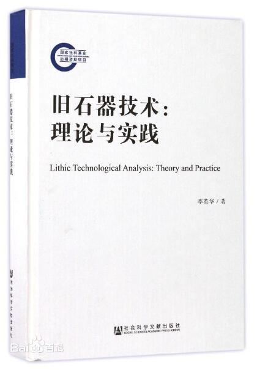
   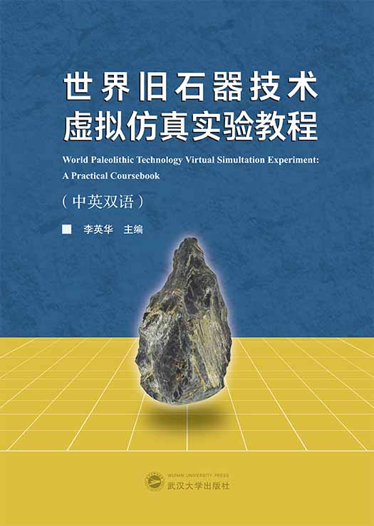
   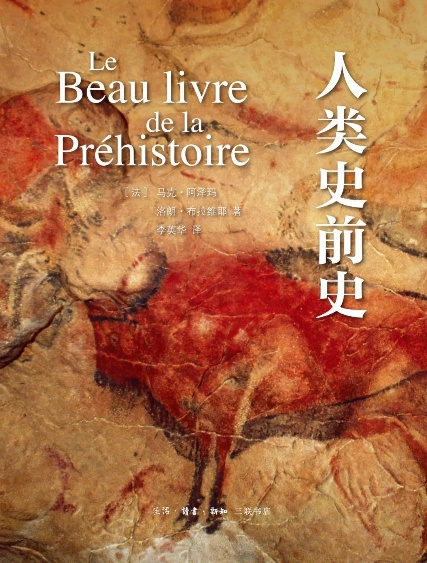

113. 图片
   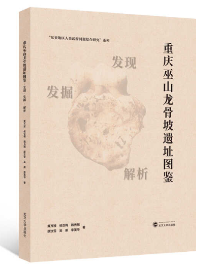
   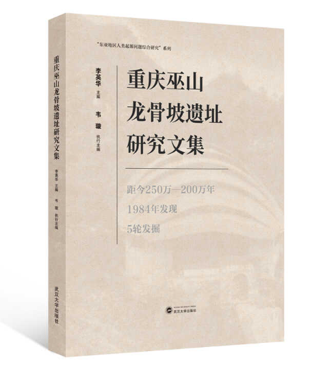

114. 项目（修改为“课程与实验”）

115. 增加的页面：

116. 1.慕课

117. 旧石器时代考古_武汉大学_中国大学MOOC(慕课)

118. 2. 虚拟仿真实验

119. 世界旧石器技术虚拟仿真实验（中英双语课程）
